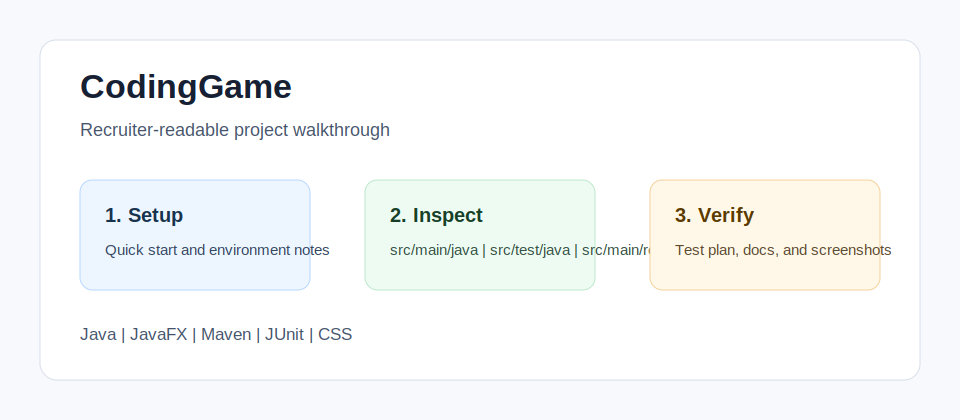

<!-- bettergithub:generated-readme -->
# CodingGame

CodingGame helps beginners learn programming concepts through a JavaFX grid game where players solve staged coding challenges. It combines game state, validation rules, level progression, practice drills, sounds, and UI resources with a Maven test suite, so reviewers can inspect both product behavior and core engineering logic.

## Tech Stack

- Java
- JavaFX
- Maven
- JUnit
- CSS
- GitHub Actions

## Quick Start

```bash
./mvnw test
./mvnw javafx:run
```

## Usage

- Launch the game from Maven.
- Use the level overrides to inspect curriculum progression.
- Review validator tests to understand how accepted answers are checked.

## Environment Variables

No .env file or API key is required. Java and Maven wrapper support are the only local configuration requirements.

## Demo and Screenshots



The diagram above is a lightweight walkthrough image for GitHub reviewers. It shows the reviewer path, the implementation areas to inspect, and the evidence this repository provides. For non-web course projects, this replaces a live demo with reproducible local setup and manual verification notes.

## Testing and Quality

Testing is documented even when the original assignment uses manual verification instead of a full automated suite.

```bash
./mvnw test
```

See [docs/test-plan.md](docs/test-plan.md) for the manual or automated checks that should be used before presenting this repository.

## Repository Structure

- `src/main/java`
- `src/test/java`
- `src/main/resources`
- `level-overrides`

## Architecture Notes

The game separates UI classes, validation rules, engine services, domain model objects, resources, and tests. This makes the educational mechanics reviewable without changing the implementation.

See [docs/architecture.md](docs/architecture.md) for a more detailed reviewer map.

## Recruiter Notes

- The README opens with the project purpose, audience, and result so the repository is scannable.
- Setup, environment, usage, testing, and architecture notes are collected in predictable sections.
- Existing source code was not changed by the documentation polish pass.

## Roadmap

- Add a short result screenshot or terminal capture after the project is rerun locally.
- Add one small automated smoke test if the course/tooling environment makes it practical.
- Keep the README aligned with the latest verified run command.

## Existing Project Notes

# Code Escape

Code Escape is a JavaFX educational puzzle game for practicing Java basics through escape-room levels. Players move around rooms, collect code tokens, inspect their inventory, find the level goal, and use the terminal to submit Java code that unlocks the exit door.

## Current Status

The project now has a playable MVP with:

- JavaFX app navigation, main menu, level select, level completion, and game-finished screens.
- Keyboard movement with collision checks for walls, doors, tokens, chests, and challenge doors.
- Twenty-four campaign levels across five stages, covering variables, printing, if-else conditions, strings, chars, methods, loops, classes, constructors, and objects.
- Optional standalone revision wings, medal-gated stage boss rooms, and a seeded daily challenge route.
- Goal and Helper tokens that reveal puzzle instructions and progressive hints.
- Inventory UI for collected code tokens and token descriptions.
- Terminal puzzle solving through token buttons or typed Java code.
- Bug/life tracking for wrong answers, with a Bug Break recovery screen after three mistakes.
- Normal and Hard modes; Hard mode hides everything outside the player's light radius.
- One saved progress slot using checkpoint saves between sessions, with Continue Game, locked future levels, medals, achievements, notebook unlocks, practice completions, recovery stamps, and stage rewards.
- A notebook and concept mastery map with interactive practice drills tied to each Java pattern.
- Escape-key pause menu with resume, main-menu return, and a delayed thank-you exit.
- Grid-authored maze, chest, challenge-door, and programmable-object gameplay for later levels, with validation for reachability and locked-room separation.
- Unit tests for validators, maze generation, progress saving, level loading, and room reward behavior.

## Run

Use the Maven wrapper with JDK 17 available.

On macOS/Linux:

```bash
./mvnw javafx:run
```

On Windows:

```bash
.\mvnw.cmd javafx:run
```

To open the standalone layout tool instead of the game:

```bash
.\mvnw.cmd javafx:run -Djavafx.mainClass=com.codeescape/com.codeescape.LevelEditor
```

The level editor saves playable overrides in `level-overrides/`. The game reads those files when it builds levels, so re-entering an edited level uses the saved walls, chests, first question door, visible/chest tokens, goal text, helper text, and accepted final answers.

## Test

On macOS/Linux:

```bash
./mvnw test
```

On Windows:

```bash
.\mvnw.cmd test
```

If Maven reports that `JAVA_HOME` is missing, set it to a JDK 17 installation before running the wrapper.

## Project Layout

- `src/main/java/com/codeescape/app`: JavaFX application flow and scene switching.
- `src/main/java/com/codeescape/engine`: game state, level loading, collision checks, and maze generation.
- `src/main/java/com/codeescape/model`: game objects such as player, room, token, chest, door, puzzle, and inventory.
- `src/main/java/com/codeescape/ui`: JavaFX views for gameplay, menus, inventory, terminal, and end screens.
- `src/main/java/com/codeescape/validation`: Java code validators used by puzzle levels.
- `src/main/resources`: CSS and image assets.
- `src/test/java`: JUnit tests for core behavior.

## Next Ideas

- Add optional medal contracts or side objectives inside levels.
- Add a player-facing custom challenge hub for editor-built rooms.

